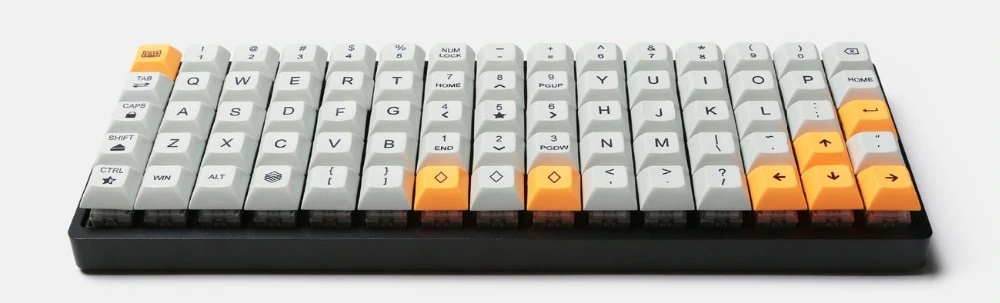
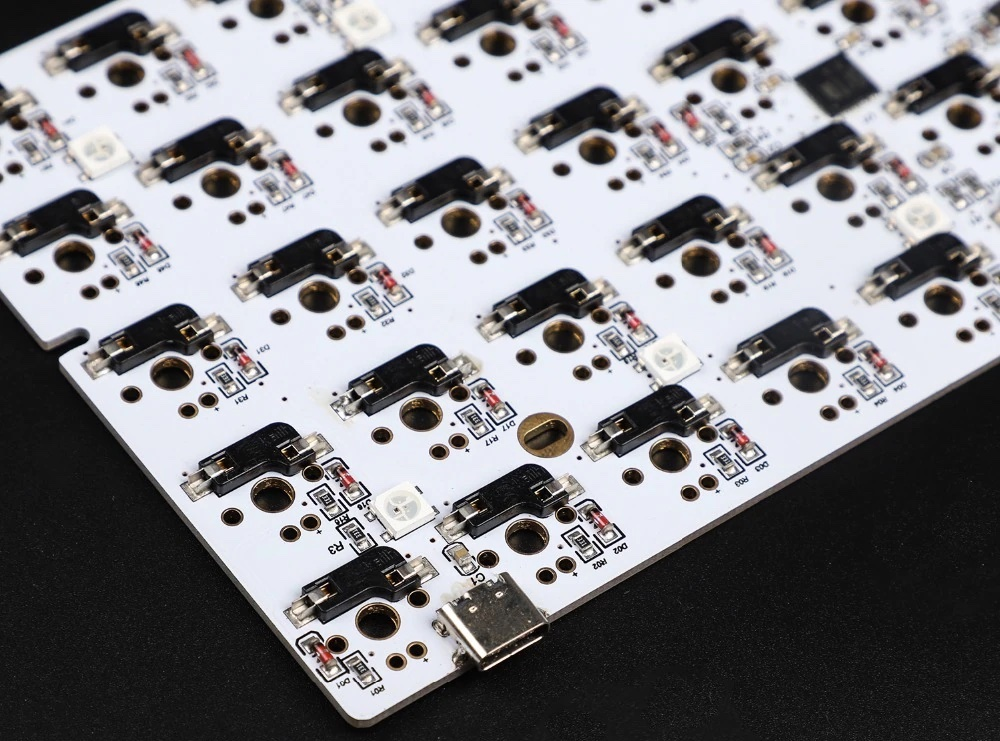

# ID (Idobo, Idobao) 75 info

> A list of resources for the Idobo (Idobao) 75 ortholinear keyboard

*I use the Workman layout but the files here are all `QWERTY`*

### Details

Controller: atmega32u4
Layout: 5x15
Keys: 75
Lighting: RBG underglow
Default firmware: QMK (with Via)

### Purchasing

Results page: https://www.aliexpress.com/wholesale?SearchText=Idobo+75
Exact model used: https://www.aliexpress.com/item/32952542823.html?spm=a2g0o.order_list.0.0.21ef1802TmFIji

### Configuring

Configuring with VIA: https://usevia.app/
Layout to use in QMK configurator: https://config.qmk.fm/#/idobao/id75/v1/LAYOUT_ortho_5x15

### Original support files

`idobao_id75.json` - Original layout
`idobao_id75_v1_via.hex` - Firmware to return the board to the original state
`Ibodo Programming Manuals.pdf` - Linked manual from the product page

### My customised firmware

- `config.h`
- `keymap.c`
- `rules.mk`

**Changes from the original:**

- [home row mods](https://precondition.github.io/home-row-mods#getting-started-with-home-row-mods-on-qmk)
- `TAPPING_TERM` at `400` to make home row mods nicer to use when typing fast
- `VIA_ENABLE` is true to make it easier to program later
- `MOUSEKEY_ENABLE` is true and some of the default settings are tweaked
- `AUTO_SHIFT_ENABLE` is true but only enabled for numbers
- `CONSOLE_ENABLE`, `COMMAND_ENABLE`, `EXTRAKEY_ENABLE` and "LOCKING" are disabled to reduce firmware size
